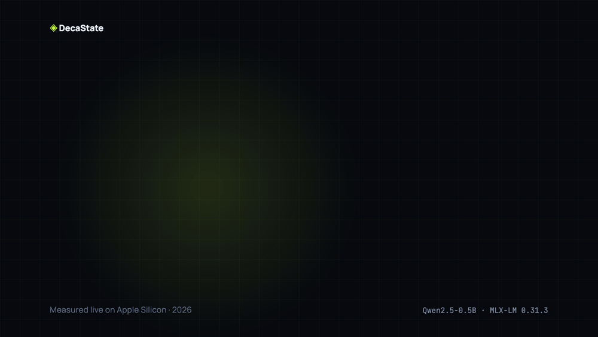
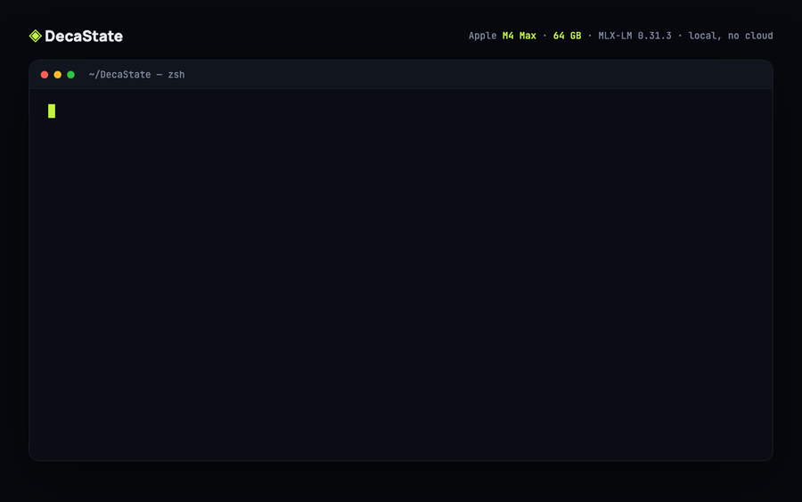

<div align="center">

# DecaState

### You already paid to understand your codebase. Stop paying for it again.

Your coding agent reads your whole repo to understand it — then a restart, a crash, or a second agent makes it read the **whole thing again, from zero.** You pay for the same context twice, five times, ten times a day. **DecaState makes you pay once.**

**Persist · Wake · Checkpoint · Rollback · Fork — real inference state, on your Mac.**

[](LICENSE)
[](benchmarks/results/long_context_resume.json)
[](benchmarks/results/long_context_resume.json)
[](benchmarks/results/fork_baseline.json)
[](docs/SECURITY.md)
[](pyproject.toml)
[](https://github.com/ml-explore/mlx)
[](benchmarks/results)

<br/>



*One command. Real timings. `decastate demo .` on this very repo — [watch the 80-second film](marketing/decastate_launch.mp4).*

<br/>



*The real lifecycle, unedited, on an **Apple M4 Max / 64 GB**: understand a repo into an 8,486-token native state, checkpoint it, fork an agent in 0.066 s, reboot, and roll back byte-exact — 0 tokens re-read.*

</div>

---

Your coding agent spends minutes reading your repository. Building context. Understanding your architecture.

Then the process dies. Or you restart. Or you want a second agent.

**And it reads everything again. From zero. Every single time.**

DecaState fixes that. It persists the model's *actual internal inference state* — the KV cache, not a chat transcript — to disk. Kill the process. Reboot the machine. Then wake the state and continue generating **as if nothing happened**, with **zero tokens of the original context re-read**.

```text
Understand the repo once
        ↓
Checkpoint  "repo-understood"
        ↓
Fork  coder / reviewer / security      ← 3 agents, one understanding, ~15 ms each
        ↓
Kill the process. Come back tomorrow.
        ↓
Wake and continue — byte-exact, no re-prefill
```

> **Understand the repo once. Fork the work, not the context.**

---

## The numbers (measured on this repo, Apple M-series, reproducible)

| Context | Cold rebuild | Wake from disk | Speedup | Tokens re-read | Continuation |
|--------:|-------------:|---------------:|--------:|---------------:|:------------|
| 128 tok | 40 ms | 9.5 ms | **4.3×** | 0 | byte-exact |
| 512 tok | 48 ms | 9.8 ms | **4.9×** | 0 | byte-exact |
| 1,024 tok | 81 ms | 10.5 ms | **7.7×** | 0 | byte-exact |
| 2,048 tok | 146 ms | 10.7 ms | **13.7×** | 0 | byte-exact |

The speedup **grows with context length** — that's the point. Cold rebuild cost scales with your context; wake cost barely moves. At real coding-agent context sizes (50K–150K tokens), rebuilding is the dominant tax.

---

## Stop paying to read the same repo twice

You already pay to process your context once — in tokens, in GPU seconds, in battery, in the seconds you sit watching an agent "read the codebase." That's fine. **You should only pay it once.**

Today you don't. Every restart, every crash, every new agent re-processes context the model *already understood*. That re-processing is pure waste — and it's exactly what DecaState eliminates.

**Redundant prefill avoided: 100%.** Not "up to." Not "in ideal conditions." In every measured run, the woken state re-reads **zero** tokens of the original context — [instrumented, not timed](benchmarks/results/phase1_native_state.json).

### What that's worth (do the math on your own workload)

One agent, holding a **100,000-token** repo context, restarted/forked **20×/day**:

```text
Without DecaState:  20 × 100,000  =  2,000,000  redundant prefill tokens / day / agent
With DecaState:                        ~0        (state is woken, not rebuilt)
```

That's **2 million tokens of re-processing, per agent, per day — gone.** Multiply by your team's agent count. The bigger your context and the more you restart or fork, the more you were wasting.

| Your context | Restarts+forks / day | Redundant tokens avoided / day | If it were a metered API @ $3/1M in* |
|---:|---:|---:|---:|
| 32K | 10 | 320K | ~$0.96 |
| 100K | 20 | 2.0M | ~$6.00 |
| 100K | 20 (×10 agents) | 20M | ~$60.00 |
| 150K | 40 | 6.0M | ~$18.00 |

<sub>*DecaState runs **locally** on MLX — you're not billed per token, so your real win is **latency + compute + battery**. The dollar column is an honest *illustration* of the same waste if this pattern ran against a metered prefill-priced API; your numbers depend on your provider and workload. We will never claim "90% off your AI bill" — [here's why that discipline matters](docs/PUBLIC_CLAIMS.md).</sub>

**The honest one-liner:** *understand the context once, reuse it forever — instead of paying for it on every restart and every fork.*

Forking an understood state into a new agent: **~15 ms**. Checkpoint create: **~15–40 ms**. All continuations are **deterministically byte-exact** after restore — verified token-by-token, not "the text looks similar".

Every row above comes from a JSON file in [`benchmarks/results/`](benchmarks/results) that you can regenerate yourself in minutes. **This repo contains zero invented numbers.**

---

## Quickstart (3 minutes, Apple Silicon)

```bash
git clone https://github.com/tempomesh/DecaState.git
cd DecaState
python3 -m venv .venv && source .venv/bin/activate
pip install -e ".[mlx]"
```

Check your machine:

```bash
decastate doctor
```

Run the full demo on **any repository** (first run downloads a ~280 MB proof model):

```bash
decastate demo .
```

Real output, real timings, this machine:

```text
DECASTATE DEMO — persistent AI state for DECASTATE

✓ [1/5] Understood repository: 17 files, 2,047 tokens of native MLX state in 147 ms
✓ [2/5] Checkpoint 'repo-understood': 25.2 MB immutable native state (14 ms)
✓ [3/5] Cold rebuild 160 ms vs wake 37 ms → 4.3× faster, 0/2,047 context tokens re-read
✓ [4/5] Forked 3 agents from one understood state: coder 15 ms, reviewer 14 ms, security 14 ms
✓ [5/5] All continuations byte-exact: True

┃ Metric                         ┃                           Value ┃
│ Repository context             │         2,047 tokens / 17 files │
│ Cold rebuild + continue        │                          160 ms │
│ Wake from disk + continue      │                           37 ms │
│ Context tokens re-read on wake │                               0 │
│ Exact continuation             │                            True │
│ Agents forked                  │ 3 (coder / reviewer / security) │
```

---

## The full lifecycle

```bash
decastate init                                      # set up ~/.decastate
decastate understand . --state-id repo-ready        # read the repo ONCE → native state
decastate checkpoint repo-ready repo-understood     # immutable named checkpoint
decastate continue repo-ready "Summarize the auth flow."
decastate fork coder                                # new agent from understood state, ~15 ms
decastate fork reviewer
decastate fork security
decastate rollback repo-ready repo-understood       # experiment went bad? restore native state
decastate status repo-ready
```

Every operation manipulates **real serialized MLX inference state** — atomic writes, fsync, file locks, SHA-256 integrity checks, and fingerprint guards that refuse to load state into the wrong model.

---

## How is this different from "memory" / chat history / routers?

| | Chat-history "memory" | LLM routers (OpenRouter etc.) | Prompt caching (APIs) | **DecaState** |
|---|---|---|---|---|
| What's saved | Text transcript | Nothing | Provider-side, opaque, expires | **The model's actual KV state, yours, on disk** |
| Restore = re-prefill? | Yes, full cost | Yes | Partial, TTL-bound | **No. Zero tokens re-read** |
| Survives process death | n/a | n/a | No control | **Yes — proven across separate OS processes** |
| Checkpoint / rollback | No | No | No | **Yes, with lineage + integrity** |
| Fork N agents from one context | Re-read N times | Re-read N times | Re-read N times | **One understanding, N branches, ~15 ms each** |
| Runs where | — | Cloud | Cloud | **100% local. Your state never leaves your machine** |

Chat-history replay is *re-reading your notes*. DecaState is *never having forgotten*.

---

## How it works

MLX-LM exposes the model's prompt cache — the per-layer KV tensors that *are* the model's working understanding of your context. DecaState:

1. **Prefills** your context once into a native MLX prompt cache.
2. **Serializes** the full cache to `safetensors` with atomic write + fsync + SHA-256.
3. **Fingerprints** it (model ID, runtime version, cache position) and **refuses** to restore into a mismatched model — corrupt, truncated, and wrong-model states are rejected, tested.
4. **Wakes** it in a *completely new process* by loading the cache and feeding only your new tokens. The original context never touches the model again.
5. **Checkpoints** are immutable objects with parent lineage — a git-like DAG for inference state. **Forks** are verified-independent branches of an understood state.

```text
AI State Runtime
├── lifecycle: save / wake / checkpoint / rollback     ← WORKING TODAY
├── sharing:   fork / dedup / copy-on-write            ← fork working; COW in research
└── portability: runtime move / model bridge / routing ← research
```

---

## What's proven vs. what's not (read this — it's why you can trust the rest)

Most AI infra READMEs oversell. This one won't. Every claim below maps to a gate script and a results file.

**Proven, on `mlx-community/Qwen2.5-0.5B-Instruct-4bit` + MLX-LM 0.31.3:**

| Claim | Evidence | Reproduce |
|---|---|---|
| Native state save / wake across **separate OS processes** | [`phase1_native_state.json`](benchmarks/results/phase1_native_state.json) | `make phase1` |
| **Zero re-prefill** on wake (instrumented token counts, not timing hand-waving) | same | `make phase1` |
| Byte-exact deterministic continuation after restore | [`long_context_resume.json`](benchmarks/results/long_context_resume.json) | `make bench-long` |
| Checkpoint / rollback with lineage, corrupt & wrong-model rejection | [`checkpoint_rollback.json`](benchmarks/results/checkpoint_rollback.json) | `make checkpoint` |
| Independent fork branches, parent unchanged | [`fork_baseline.json`](benchmarks/results/fork_baseline.json) | `make fork` |
| Real coding-agent repo workflow | [`coding_agent_demo.json`](benchmarks/results/coding_agent_demo.json) | `decastate demo .` |

**Not proven, not claimed:**

- Copy-on-write storage savings — forks are **physical copies** today. We ran the APFS clonefile experiment ([results](benchmarks/results/cow_research.json)); it did **not** show physical savings, so we don't claim them. Negative results get published here too.
- Cross-runtime migration (llama.cpp, vLLM), cross-model state translation, cloud storage, multi-user serving — all research-stage. See [ROADMAP](docs/ROADMAP.md).
- Big-model numbers. The proof model is deliberately small (0.5B) so anyone can verify in minutes. Larger-model and larger-context benchmarks are next; the mechanism is model-size-independent, but we publish measurements, not extrapolations.

Full claim discipline: [docs/PUBLIC_CLAIMS.md](docs/PUBLIC_CLAIMS.md).

---

## Verify everything yourself

```bash
make test          # unit + integration tests
make phase1        # process-death restore proof (2 real OS processes)
make bench-long    # cold-vs-wake at 128/512/1K/2K tokens
make checkpoint    # checkpoint/rollback gate incl. corruption rejection
make fork          # fork independence gate
decastate demo .   # the whole story, one command
```

Each gate **hard-fails** (non-zero exit) if any correctness property breaks. These are the same commands CI of one honest laptop runs.

---

## Roadmap

- **Now** — persistent state for coding agents on Apple Silicon: save / wake / checkpoint / rollback / fork. ✅ shipping
- **Next** — branch wake orchestration, bigger models & contexts, `decastate demo` polish, COW research round 2.
- **Then** — llama.cpp adapter (same model, different runtime), state-aware routing, cross-model bridges — each gated behind measured proof, in public.

```text
MODEL changes · RUNTIME changes · PROCESS dies · MACHINE changes
                        but
                 AI STATE continues
```

---

## Requirements

- Apple Silicon Mac (MLX). Linux/CUDA users: the llama.cpp adapter is the top roadmap item — watch/star to follow.
- Python 3.10+
- ~300 MB disk for the proof model; state files are ~12 MB per 1K tokens of context (published, measured).

## Contributing & Security

Issues and PRs welcome — especially runtime adapters, larger-model benchmark runs, and COW research. State files can contain your code and conversations: everything is **local-only by default, nothing is ever uploaded**. See [docs/SECURITY.md](docs/SECURITY.md) and [docs/OPERATIONS.md](docs/OPERATIONS.md).

## License

[MIT](LICENSE).

---

<div align="center">

**If your agent ever re-read a repo it already understood — star this repo. That's the bug we're fixing.**

*DecaState — Keep the state. Change everything else.*

</div>
